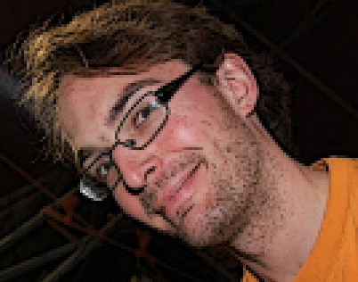

# Vanliga frågor

Här är måsta vanliga frågor, som är:

 * Ålder
 * Material
 * Beteende för barn
 * Beteende för föräldrar

## Ålder

### Jag är under 8 år. Är jag välkommen?

Tack för att du läste detta, för 8 år är bara en riktlinje!
Denna riktlinje finns av en anledning: programmering är en
svår (men cool!) hobby.

Men är du yngre än 8 år och du kan redan programmera,
då är du mycket välkommen!

Vi vet av erfarenhet att barn under 8 år som regel är
kan komma överens dåligt.

### Jag är över 18 år. Är jag välkommen?

Bra att du läste detta, för 18 år är bara en riktlinje!
Denna riktlinje finns av en anledning: kursen 
är första för minderåriga.

Men det är väldigt trevligt att ha vuxna på kursen: 
barnen kommer att utbilda dig (de lär sig av detta!) 
och dra nytta av lugnet
som vuxna brukar ta med sig. Och många vuxna
gillar att undervisas av minderåriga.

Kort sagt: kom förbi!

## Material

### Vad brukar jag tar med?

Du brukar enkelt en bärbar dator med laddare, 
bästa med [Processing installerat](https://processing.org/download/).

### Brukar jag tar med min mobil?

Nej, det är inte viktigt för programmera.
Ännu värre: det hjälper **mot** att blir en stor programmerare!
Snälla, lämna din mobil hemma och stelle den av.

## Beteende för barn

### Kan jag göra spel?

Oh ja!

I själva verket spelprogrammering 
är ett av de roligaste sätten att lära sig programmering.

### Kan jag spela?

Nej. 
Dit är en kurs där lärande kommer först.
Spel bidrar inte till att lära sig programmera.
Inte ens före kursen, inte ens under rast och inte efter slut.
Har du *själv* programmerat ett spel,
då får du visa din spelet och testa det.

### Vem ställer jag en fråga?

 * Sitter det en student bredvid dig? Om ja, då är han/hon.
 * Finns det en student vid ditt bord? Om ja, då är han/hon
 * Om ingen är där eller ingen vet, fråga en vuxen

### Vad händer om en ny student kommer in?

 * Värd/värdinna tar hand om honom/henne:
   * Lägg på din kappa
   * Namnlista
   * Länkar till en student som vill starta honom / henne: de sitter sedan vid det stora bordet

## Beteende för föräldrar

### Är jag vilkommen att stänna?

Föräldrar är alltid vilkommen att kolla lite att våra jättebra kurs.

Oavsett, för din barn är det bättre det hon/han kann göra nya
kompissar (och dina problemen med det!). 
Därför frågor vi det du -när det är möjligt- åker tillbaka
efter lämnar din(a) barn. Förutom det finns det mycket plats
i vårs Makerspace var du kan göra dina egena saker.

Ett tips: kommer 5 minuter före slutet för en kort titt :-)

### Är jag vilkommen att hjälpa?

Javisst! Du kann bli en frivilligare. 
För din(a) barn versöker vi det du är i olika grup som din(a) barn.

## Beteende för frivilligare

### Är jag vilkommen?

Javisst!

## Lektioner och läromedel

### Var finns lektionerna?

Behandlingslektioner finns på webbplatsen 
[Processing för tonåringar] (https://github.com/richelbilderbeek/processing_foer_tonaaringar).

## Jag vill göra Processing, är det möjligt?

Jo det kan du! [Ladda ner Processing här](https://processing.org/download/).

Processing lektionerna finns på webbplatsen
[Processing för tonåringar] (https://github.com/richelbilderbeek/processing_foer_tonaaringar).

## Jag vill göra någon med händer, är det möjligt?

Javiss, men inte här; dit är bara en programmeringskurs.

Lyckligtvis, det finns det också den Makerkids i Uppsala Makerspace!
[Ser aktivitäter her](https://www.uppsalamakerspace.se/aktiviteter).

## Människor

### Vem är volontärer?

 * Richel

### Vem är [Richel] (https://github.com/richelbilderbeek)?

Richel är en vuxen volontär och samordnar kursen.

Richel har programmerat sedan han var 8 år.
Han är den mest erfarna och vällästa programmeraren, särskilt inom C++.
Richel är särskilt intresserad av utbildning och har
avslutade lärarutbildningen vid universitetet och har två år som
lärare på en Högstadiet.

Hans arbete kan ses på 
[hans webbplats med mer än 3900 sidor](http://richelbilderbeek.nl) 
och [mer än 1200 GitHub-arkiv] (https://github.com/richelbilderbeek?tab=repositories).

## Andere frågor

### Varför kostar kursen så lite?

För att vi arbetar med frivilligar.
Alla kostnader är för böckerna.

Prisar från [pixelpalace.se](http://pixelpalace.se/).

Kurs är 8 böcker som är max 30 doppel-sida (faltet) A4.

 * Färg: 1 bok är 175 SEK (när enkelt, 100 SEK pro 10)
 * Svart-vid: 1 bok är 100 SEK (när enkelt, 400 SEK pro 10)

2 certifikator:

 * Färg: 1 certifikat är 54 SEK

Lektionskort:

 * Svart-vid: 1 kort är 43 SEK (när enkelt, 65 SEK pro 10, 90 SEK pro 20)

Pro elev och semester:

 * 4x SV böcker = 400 SEK
 * 1x certificat = 54 SEK
 * 1x lektionskort = 43 SEK

Det betyder, 
när det finns inga böcker, 
kostnader är 500 SEK pro elev pro semester.

